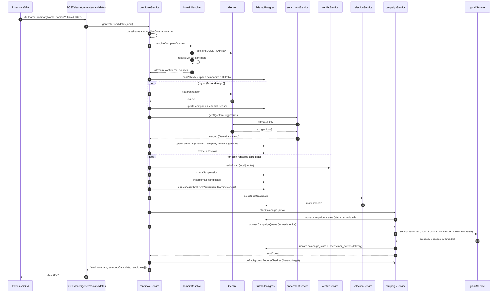
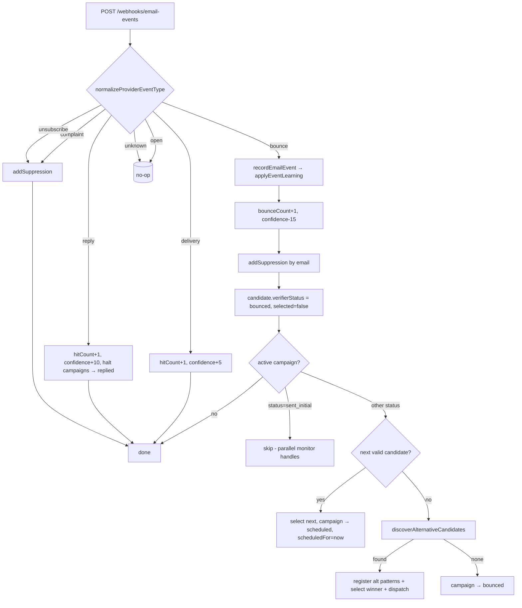
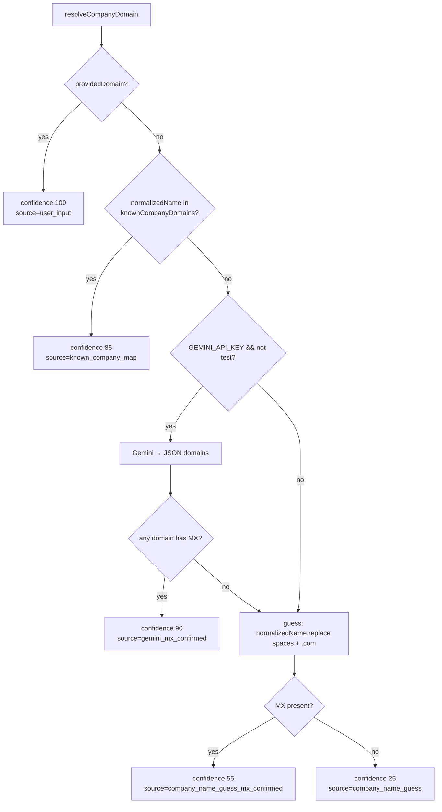
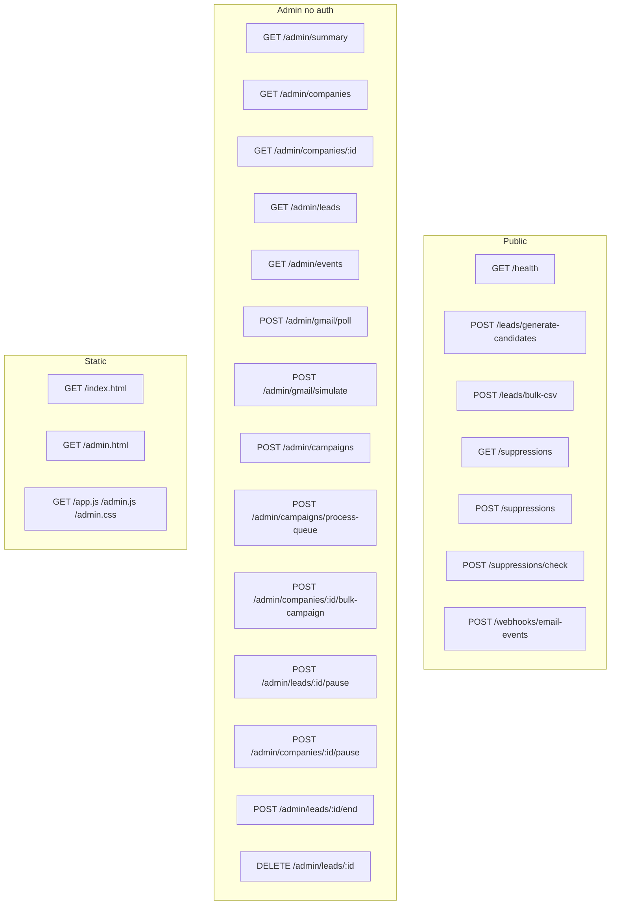
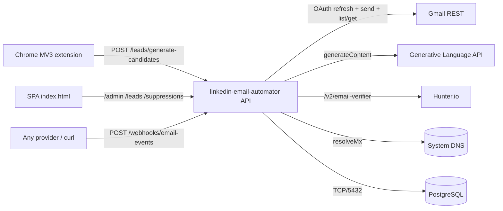

# LinkedIn Email Automator — Knowledge Graph

> Companion to [ARCHITECTURE.md](./ARCHITECTURE.md). All diagrams are Mermaid; render in any Markdown viewer that supports it (VS Code preview, GitHub).

---

## 1. Domain Entity Graph (DB)

```mermaid
erDiagram
    COMPANIES ||--o{ COMPANY_EMAIL_ALGORITHMS : has
    COMPANIES ||--o{ LEADS : "employs (captured)"
    COMPANIES ||--o{ EMAIL_CANDIDATES : "denormalized link"
    EMAIL_ALGORITHMS ||--o{ COMPANY_EMAIL_ALGORITHMS : "ranked per company"
    EMAIL_ALGORITHMS ||--o{ EMAIL_CANDIDATES : "rendered from"
    LEADS ||--o{ EMAIL_CANDIDATES : "has guesses"
    LEADS ||--|| CAMPAIGN_STATES : "1:1 outreach"
    EMAIL_CANDIDATES ||--o{ EMAIL_EVENTS : "audit trail"
    EMAIL_CANDIDATES ||--o{ CAMPAIGN_STATES : "target candidate"
    SUPPRESSION_ENTRIES }o..o{ EMAIL_CANDIDATES : "blocks by email/domain"

    COMPANIES {
        string id PK
        string name
        string normalizedName UK
        string domain
        int    domainConfidence
        string domainSource
        string researchReason
    }
    EMAIL_ALGORITHMS {
        string id PK
        string key UK
        string patternTemplate UK
        string description
        string example
    }
    COMPANY_EMAIL_ALGORITHMS {
        string id PK
        string companyId FK
        string algorithmId FK
        int    hitCount
        int    missCount
        int    verificationSuccessCount
        int    bounceCount
        int    confidenceScore
        int    rank
        date   lastVerifiedAt
    }
    LEADS {
        string id PK
        string fullName
        string firstName
        string middleName
        string lastName
        string companyId FK
        string linkedinUrl
        string headline
        string source
        string status
    }
    EMAIL_CANDIDATES {
        string id PK
        string leadId FK
        string companyId FK
        string algorithmId FK
        string email
        bool   syntaxValid
        bool   mxValid
        string verifierProvider
        string verifierStatus
        int    verifierScore
        bool   isCatchAll
        bool   selected
    }
    CAMPAIGN_STATES {
        string id PK
        string leadId FK_UK
        string candidateId FK
        string status
        string jobLink
        string jobId
        string resumePath
        string resumeName
        date   scheduledFor
        date   lastSentAt
        int    followupCount
        int    followupIntervalMinutes
        int    maxFollowups
        string subject
        string body
        bool   respectTiming
        bool   isPaused
        bool   skipBounceMonitor
    }
    EMAIL_EVENTS {
        string id PK
        string candidateId FK
        string eventType
        string provider
        json   rawPayload
    }
    SUPPRESSION_ENTRIES {
        string id PK
        string email
        string domain
        string reason
        string source
    }
```

---

## 2. Module / Service Dependency Graph

```mermaid
graph LR
    subgraph Frontends
        EXT[Chrome Extension popup.js + contentScript.js]
        SPA[SPA app.js / index.html]
        ADM[Legacy admin.js / admin.html]
    end

    subgraph Routes
        R_LEADS[/leads/*]
        R_ADMIN[/admin/*]
        R_SUPP[/suppressions/*]
        R_WH[/webhooks/email-events]
        R_HEALTH[/health]
    end

    subgraph Services
        CS[candidateService]
        SEL[candidateSelectionService]
        ENR[algorithmEnrichmentService]
        VER[emailVerifierService]
        LRN[learningService]
        EVT[emailEventService]
        SUP[suppressionService]
        GML[gmailService]
        CMP[campaignService]
    end

    subgraph Modules
        NP[nameParser]
        CN[companyNormalizer]
        DR[domainResolver]
        TPL[emailTemplate]
        VAL[emailValidation]
        RNK[algorithmRanking]
        CAT[algorithmCatalog]
    end

    subgraph Lib
        PR[(Prisma client)]
        GM[gemini]
    end

    subgraph External
        PG[(PostgreSQL)]
        GEMAPI[(Gemini API)]
        GMAILAPI[(Gmail API)]
        HUNT[(Hunter API)]
        DNS[(DNS MX)]
    end

    EXT --> R_LEADS
    SPA --> R_LEADS
    SPA --> R_ADMIN
    SPA --> R_SUPP
    ADM --> R_ADMIN

    R_LEADS --> CS
    R_LEADS --> CN
    R_LEADS --> PR
    R_ADMIN --> PR
    R_ADMIN --> GML
    R_ADMIN --> CMP
    R_SUPP --> SUP
    R_WH --> EVT
    R_HEALTH --> PR

    CS --> NP
    CS --> CN
    CS --> DR
    CS --> TPL
    CS --> VAL
    CS --> RNK
    CS --> ENR
    CS --> VER
    CS --> LRN
    CS --> SEL
    CS --> SUP
    CS --> CMP
    CS --> GM

    ENR --> CAT
    ENR --> GM
    DR --> GM
    DR --> DNS
    DR --> CN
    VAL --> DNS

    VER --> HUNT
    SEL --> SUP
    LRN --> PR
    EVT --> SUP
    EVT --> CS
    EVT --> PR

    CMP --> GML
    CMP --> EVT
    CMP --> CS
    CMP --> PR

    GML --> GMAILAPI
    GM --> GEMAPI
    SUP --> PR
    CS --> PR
    SEL --> PR
    PR --> PG
```

> Note the cycle `campaignService ↔ candidateService ↔ campaignService` — handled by dynamic `import()` calls inside `emailEventService.ts` and `campaignService.ts` to break circular ESM resolution.

---

## 3. Candidate Generation Pipeline (sequence)



---

## 4. Outbox Queue & Bounce Auto-Rotation

```mermaid
stateDiagram-v2
    [*] --> draft : startCampaign (rare; only if input invalid)
    [*] --> scheduled : startCampaign (normal)

    scheduled --> sent_initial : processCampaignQueue\nsendGmailEmail OK\n(skipBounceMonitor branch or parallel branch)
    scheduled --> bounced : send fails (skipBounceMonitor branch)
    sent_initial --> sent_followup_1 : queue tick after followupIntervalMinutes
    sent_followup_1 --> sent_followup_2 : ...
    sent_followup_2 --> sent_followup_3 : ...
    sent_followup_3 --> completed : followupCount > maxFollowups

    sent_initial --> scheduled : emailEventService.applyEventLearning\nbounce + non-skipBounceMonitor parallel branch SKIPS (monitor handles)
    sent_initial --> bounced : Background bounce monitor:\nall candidates bounced + alt discovery fails
    state any_active <<choice>>
    sent_followup_1 --> any_active
    sent_followup_2 --> any_active
    any_active --> scheduled : recordEmailEvent(bounce)\nnext non-bounced candidate found
    any_active --> bounced : no remaining candidates + alt discovery fails

    sent_initial --> replied : recordEmailEvent(reply)
    sent_followup_1 --> replied : recordEmailEvent(reply)
    sent_followup_2 --> replied : recordEmailEvent(reply)

    scheduled --> scheduled : isPaused toggle (no transition; queue just skips)
    sent_initial --> sent_initial : respectTiming outside 9-5 (skipped)

    completed --> [*]
    bounced --> [*]
    replied --> [*]
```



---

## 5. Email Event Learning Map



---

## 6. Domain Resolution Decision Tree



> The downstream **MX gate** in `candidateService.generateCandidates` aborts generation if the resolved domain has no MX, regardless of source.

---

## 7. HTTP Surface Map



---

## 8. External Surface



---

## 9. Concurrency / Background Tasks

| Task | Trigger | Cadence | Guard |
|---|---|---|---|
| `startCampaignScheduler` (poll bounces + process queue) | `buildApp` | every 20 s | none (interval is single) |
| `processCampaignQueue` (manual) | `/admin/campaigns/process-queue`, also after `startCampaign` in `generateCandidates` and `/admin/campaigns` | on demand | `isProcessingQueue` module bool |
| `runBackgroundBounceChecker` | `processCampaignQueue` (parallel branch) `setTimeout(0)` AND `generateCandidates` after queue tick | up to 5 cycles × 25 s | none |
| `syncCompanyResearch` | `generateCandidates` step 5 (async) and `/leads/bulk-csv` per row (async) | once per company until DB row populated | `activeResearchPromises` map |
| SPA poll | `setInterval(updateUI, 5000)` | every 5 s | none |

---

## 10. Glossary

- **Algorithm** — a named email pattern template (`{first}.{last}@{domain}`).
- **Candidate** — a single rendered email for one lead × one algorithm.
- **Pre-verified** — a `verifierStatus` value written only by `/leads/bulk-csv` to mark trusted direct emails; causes campaign to `skipBounceMonitor=true`.
- **Selected** — exactly one candidate per lead at any time; set by `selectBestCandidate`, overridden by `startCampaign` and the auto-rotator.
- **Active campaign** — `status ∈ {scheduled, sent_initial, sent_followup_1…}` AND `isPaused=false`.
- **Alt pattern** — a Gemini-generated template registered when all standard candidates bounce; stored with `key` prefixed `alt_`.
